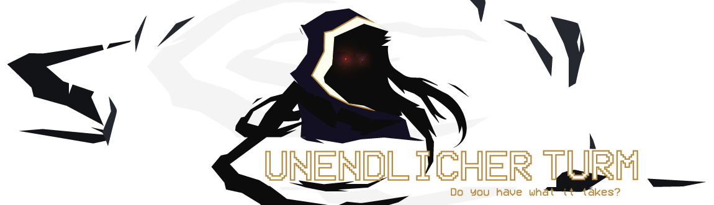
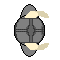
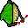
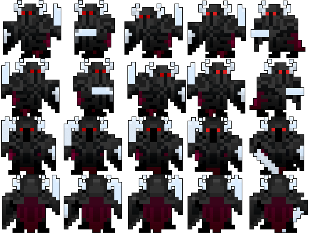
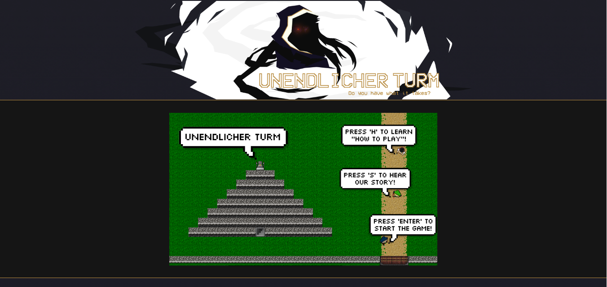
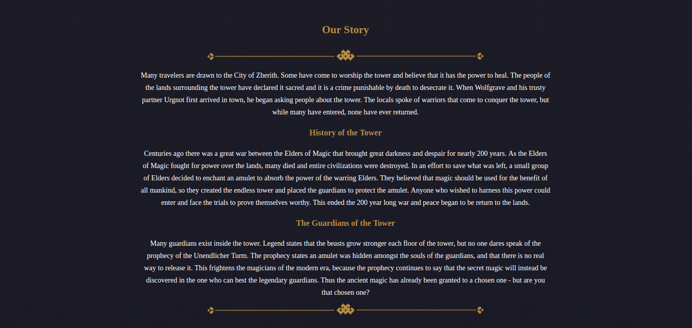
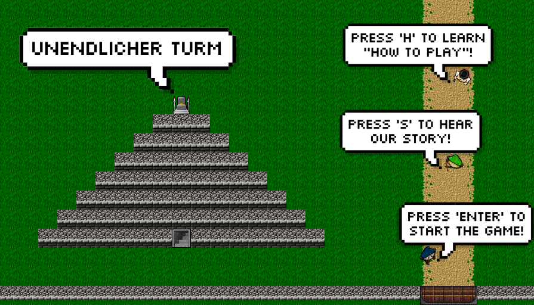
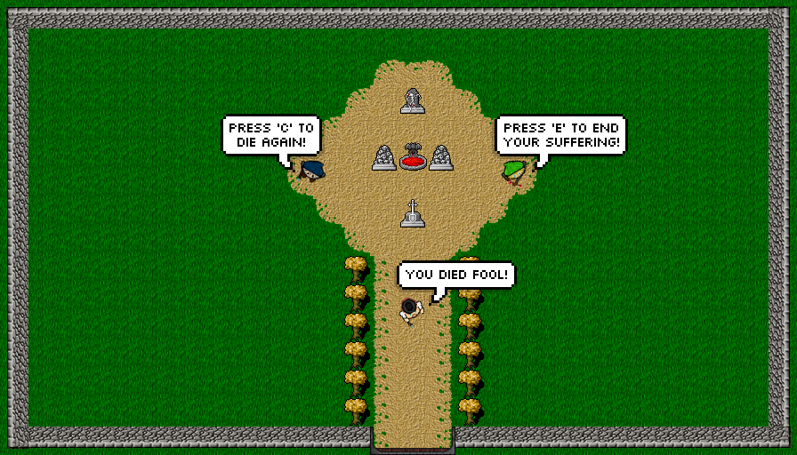
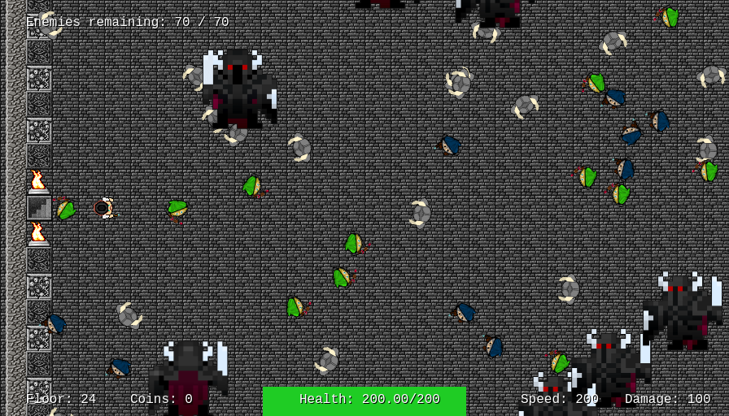
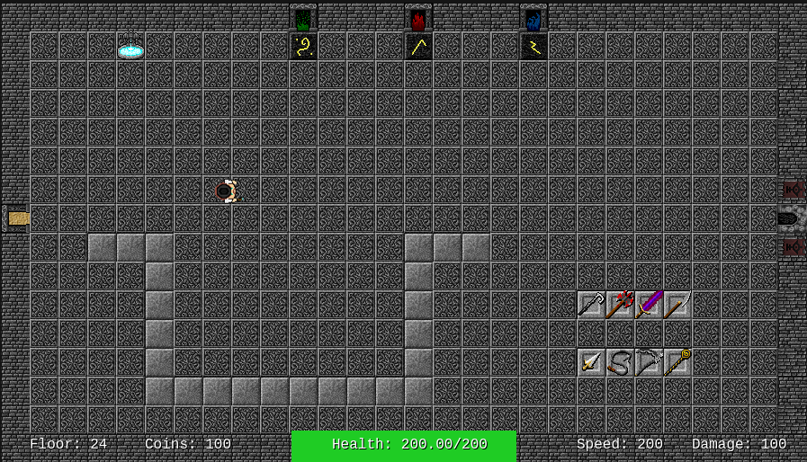

# Unendlicher Turm

A top-down bullet hell wave survivor.

Built entirely in JavaScript, utilizing Phaser and Node.js.

The project is available online at https://unendlicher-turm.now.sh and https://cecil.now.sh.

## CSE 4453 Game Design Assignment 1

This project was written by Team Cecil, which consisted of

- Josh Hawkins [GitHub](https://github.com/hawkins)
- Dalton Childers [GitHub](https://github.com/jdaltonchilders)
- Beck [GitHub](https://github.com/wfmonster)
- Sean McQuilling [GitHub](https://github.com/semcq)

### Assets

#### Enemies

The knight was custom-made from scratch.

Archer and Wizard were found on OpenGameArt.org.

Guardian is a third-party spritesheet inspired by Realm of the Mad God custom modified to fit out game.

| Knight | Wizard | Archer | Guardian |
|:-:|:-:|:-:|:-:|
|  |  |  |  |

#### Tilemaps and misc assets

Maps were all custom-made. However, the tilesheet used was found on OpenGameArt.org.

Quotes were generated from third party sites like PixelSpeechBubble.com.

### Sounds

The arena music came from Realm of the Mad God.

The player death sound came from PacMan.

All other sounds were found on OpenGameArt.org.

### Screenshots

#### Webpage

| Top | Story |
|:-:|:-:|
|  |  |

#### Menus

| Main | Defeat |
|:-:|:-:|
|  |  |

### Gameplay

| Town | Arena | Shop |
|:-:|:-:|:-:|
|  |  |   |

### Setting up dev environment

If you're not already familiar with Node.js, you can download it [here](https://nodejs.org/en/). Be sure to allow the extra features it asks for, like `npm`.

1. From your terminal / command prompt, run `npm install`
2. You can run `npm start` to start the server locally
3. Open `127.0.0.1:8080` in your browser to see the game
